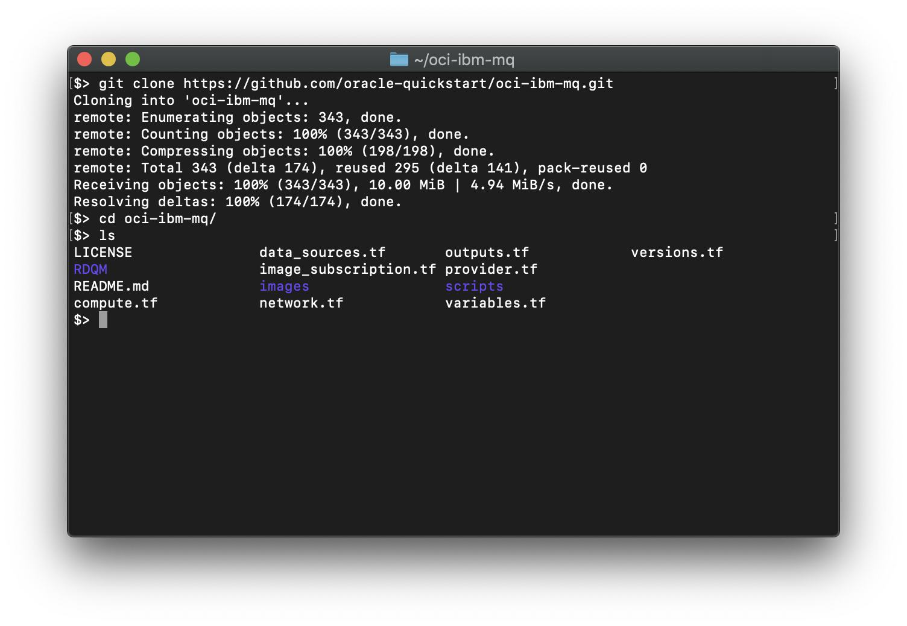

```diff
! THIS README IS UNDER CONSTRUCTION !
```
 
# IBM MQ
These are Terraform modules that deploy IBM MQ nodes on Oracle Cloud Infrastructure (OCI). They are developed jointly by Oracle and IBM. For an advanced IBM QM installation (referred to as RDQM) which installs on a Red Hat compute instance see [RDQM/README.md](RDQM/README.md) (not fully supported yet).

## Prerequisites One: Setting up your terraform configuration
First off you'll need to do some pre deploy setup.  That's all detailed [here](https://github.com/oracle-quickstart/oci-prerequisites).

## Prerequisite Two: Set up a shared file system
IBM MQ requires a shared file system to store queue manager data. At the time of writing this document, users will need to launch an [NFS Server High Availibilty Cluster](https://cloudmarketplace.oracle.com/marketplace/en_US/listing/82147253) into their tenancy prior to launching the MQ nodes created by this Quick Start. Launch the NSF server stack with the following parameters:

 * FILESYSTEM TYPE: *Persistent*
 * ACTIVE/PASSIVE HIGHLY AVAILABLE: *Check*
 * SSH PUBLIC KEY: *Copy/paste `~/.ssh/oci`*
 * AVAILABILITY DOMAIN: *users choice*
 * USE EXISTING VCN: *Uncheck*
 * VPC CIDR: *default*
 * BASTION COMPUTE SHAPE: *default*
 * BASTION_HOSTNAME_PREFIX: *default*
 * NFS STORAGE SERVER COMPUTE SHAPE: *VM.Standard2.8*
 * STORAGE_SERVER_HOSTNAME_PREFIX: *default*
 * BLOCK VOLUME STORAGE PERFORMACE TIER: *default*
 * NUMBER OF BLOCK VOLUMES: *default:2 ?*
 * BLOCK VOLUME SIZE: *default:50 ?*
 * QUOROM SERVER COMPUTE SHAPE: *default*
 * QUOROM SERVER HOSTNAME: *default*
 * CREATE COMPUTE NODES: *Uncheck*

## Clone the Module
Now that the prerequisites are out of the way, you'll want a local copy of this repo.  You can make that with the commands:

    $> git clone https://github.com/oracle-quickstart/oci-ibm-mq.git
    $> cd oci-ibm-mq
    $> ls

That should give you this:



Users will need to make 3 modifications:
 1. If your region is something other than "US East (Ashburn)" you will need to modify the `platform_image` variable in the `compute.tf` file to refer to the proper image ocid of the `Oracle-Linux-7.7-2020.01.28-0` image in your home region. See [this page](https://docs.cloud.oracle.com/en-us/iaas/images/image/0a72692a-bdbb-46fc-b17b-6e0a3fedeb23/) for the lookup table which correlates home region to image ocid. If your home region is "US East (Ashburn)" you can skip this step.


 2. Set the `vcn_id` variable in the `variables.tf` file to the OCID of the virtuakl cloud network. This can be found Using the *Control Panel navigation menu -> Networking -> Virtual Cloud Networks -> nfs*
 
 

 3. Set the `vcn_subnet_id` variable in the `variables.tf` file to the OCID of the virtuakl cloud network. This can be found Using the *Control Panel navigation menu -> Networking -> Virtual Cloud Networks -> nfs -> public*
 
  
 
 We now need to initialize the directory with the module in it.  This makes the module aware of the OCI provider.  You can do this by running:

    $> terraform init

This gives the following output:


## Deploy
Now for the main attraction.  Let's make sure the plan looks good:

    $> terraform plan

That gives:


If that's good, we can go ahead and apply the deploy:

    $> terraform apply

You'll need to enter `yes` when prompted.  The apply should take two to three minutes.  Once complete, you'll see something like this:


## Connect to an MQ NODE
When the `terraform apply` completes you can SSH into the one of the nodes of the IBM MQ cluster:

    $> ssh -i ~/.ssh/oci opc@<public_ip_address>

Configuration is happening asyncronously, and is complete when cloud-init finishes. You can view status or debug deployments by investigating the cloud-init entries in the `/var/log/messages` file:

    $> sudo -i
    $> cd /var/logs
    $> grep cloud-init messages


## Run IBM MQ commands
Source the IBM MQ installation script and display the version of the IBMQ software:

    $> . /opt/mqm/bin/setmqenv -s
    $> dspmqver
    


Check the status of the active and standy nodes:

    $> dspmq -x


## Test the installation

## Destroy the Deployment
When you no longer need the deployment, you can run this command to destroy it:

    $> terraform destroy

You'll need to enter `yes` when prompted.  Once complete, you'll see something like this:


