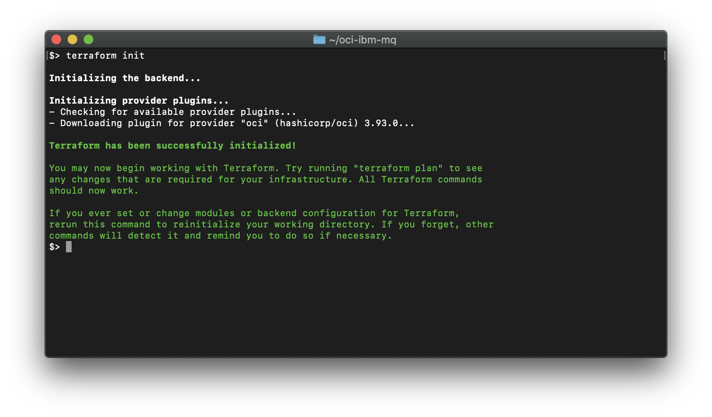

```diff
! THIS README IS UNDER CONSTRUCTION !
```
 
# IBM MQ
These are Terraform modules that deploy IBM MQ on Oracle Cloud Infrastructure (OCI). They are developed jointly by Oracle and IBM. For an advanced RDQM installation which installs on a Red Hat compute instance see [RDQM/README.md](RDQM/README.md) (not fully supported yet).

## Prerequisites
1. First off you'll need to do some pre deploy setup.  That's all detailed [here](https://github.com/oracle-quickstart/oci-prerequisites).

2. The compute image for the IBM MQ image is a custom image based off Oracle Linux 7.7. It has Red Hat Compatible Kernel (RHCK) and a few minor changes to the Linux kernel configuration. In order for this README to work, users will need to [download the custom image](https://objectstorage.us-ashburn-1.oraclecloud.com/p/HBb6fQS2Yg_lNVtX7WR-G8YlinMKixxdUkBzeZROo6w/n/partners/b/bucket-20200513-1843/o/OracleLinux7.7-RHCK-limits.conf) and put it into their tenancy as a custom image. ***Users will need to refer to the OCID of this custom image in the terraform code.***

For reference, the changes made to the standard Oracle Linux 7.7 image can be describes as follows:

    ## Set the GRUB 2 boot loader to load RHCK at reboot.
    $> grubby --set-default /boot/vmlinuz-3.10.0-1062.12.1.el7.x86_64
    
    ## Add the following lines to the /etc/security/limits.conf file.
    echo '* - nofile 10240'
    echo 'root - nofile 10240'

## Clone the Module
Now, you'll want a local copy of this repo.  You can make that with the commands:

    $> git clone https://github.com/oracle-quickstart/oci-ibm-mq.git
    $> cd oci-ibm-mq
    $> ls

That should give you this:


Users will need to make 3 modifications:
 1. If your region is something other than "US East (Ashburn)" you will need to modify the `platform_image` variable in the `compute.tf` file to refer to the proper image ocid of the `Oracle-Linux-7.7-2020.01.28-0` image in your home region. See [this page](https://docs.cloud.oracle.com/en-us/iaas/images/image/0a72692a-bdbb-46fc-b17b-6e0a3fedeb23/) for the lookup table which correlates home region to image ocid. If your home region is "US East (Ashburn)" you can skip this step.


 2. Set the `vcn_id` variable in the `variables.tf` file to the OCID of the virtuakl cloud network. This can be found Using the *Control Panel navigation menu -> Networking -> Virtual Cloud Networks -> nfs*
 
 

 3. Set the `vcn_subnet_id` variable in the `variables.tf` file to the OCID of the virtuakl cloud network. This can be found Using the *Control Panel navigation menu -> Networking -> Virtual Cloud Networks -> nfs -> public*
 
  
 
 We now need to initialize the directory with the module in it.  This makes the module aware of the OCI provider.  You can do this by running:

    $> terraform init

This gives the following output:



## Deploy
Now for the main attraction.  Let's make sure the plan looks good:

    $> terraform plan

That gives:


If that's good, we can go ahead and apply the deploy:

    $> terraform apply

You'll need to enter `yes` when prompted.  The apply should take two to three minutes.  Once complete, you'll see something like this:


## Connect to an MQ NODE
When the `terraform apply` completed...

## SSH to an MQ Node
When the `terraform apply` completes you can SSH into the one of the nodes of the IBM MQ cluster:

    $> ssh -i ~/.ssh/oci opc@<public_ip_address>

Configuration is happening asyncronously, and is complete when cloud-init finishes. You can view status or debug deployments by investigating the cloud-init entries in the `/var/log/messages` file:

    $> sudo -i
    $> cd /var/logs
    $> grep cloud-init messages


## Run IBM MQ commands
Become user `root` to source the IBM MQ installation output the version of the IBMQ software:

    $> sudo -i
    $> . /opt/mqm/bin/setmqenv -s
    $> dspmqver
    


Check the status of other nodes in the cluster:

    $> rdqmstatus -n


## View the Cluster in the Console
You can also login to the web console to view the IaaS that is running the cluster.


## Destroy the Deployment
When you no longer need the deployment, you can run this command to destroy it:

    $> terraform destroy

You'll need to enter `yes` when prompted.  Once complete, you'll see something like this:


