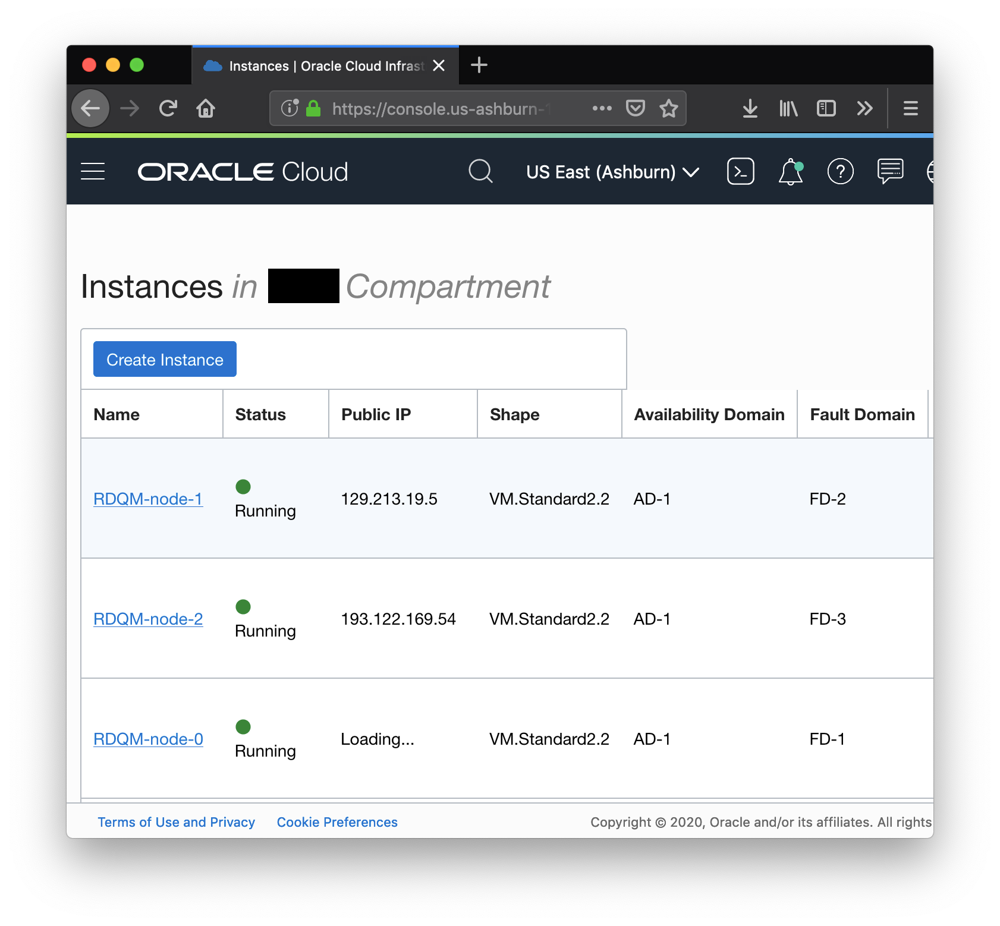

# oci-ibm-mq
These are Terraform modules that deploy IBM MQ on Oracle Cloud Infrastructure (OCI). They are developed jointly by Oracle and IBM.

## Prerequisites
First off you'll need to do some pre deploy setup.  That's all detailed [here](https://github.com/oracle-quickstart/oci-prerequisites).

## Clone the Module
Now, you'll want a local copy of this repo.  You can make that with the commands:

    $> git clone https://github.com/oracle-quickstart/oci-ibm-mq.git
    $> cd oci-ibm-mq
    $> ls

That should give you this:

We now need to initialize the directory with the module in it.  This makes the module aware of the OCI provider.  You can do this by running:

    $> terraform init

This gives the following output:

## Deploy
Now for the main attraction.  Let's make sure the plan looks good:

    $> terraform plan

That gives:

If that's good, we can go ahead and apply the deploy:

    $> terraform apply

You'll need to enter `yes` when prompted.  The apply should take two to three minutes.  Once complete, you'll see something like this:

## Connect to the Cluster
When the `terraform apply` completed...

## SSH to a Node
These machines are using Red Hat Enterprise Linux 7.7 (RHEL).  The default login is opc.  You can SSH into the machine with a command like this:

    $> ssh -i ~/.ssh/oci opc@<Public IP Address>

You can debug deployments by investigating the cloud-init entries in the  journal using the `journalctl` utility:

    $> sudo -i
    $> journalctl | grep cloud-init

## Run IBM MQ commands
Become root to source the IBM MQ installation output the version of the IBMQ software:

    $> . /opt/mqm/bin/setmqenv -s
    $> dspmqver
    

Check the status of other nodes in the cluster:

    $> rdqmstatus -n

## View the Cluster in the Console
You can also login to the web console to view the IaaS that is running the cluster.

## Destroy the Deployment
When you no longer need the deployment, you can run this command to destroy it:

    $> terraform destroy

You'll need to enter `yes` when prompted.  Once complete, you'll see something like this:

